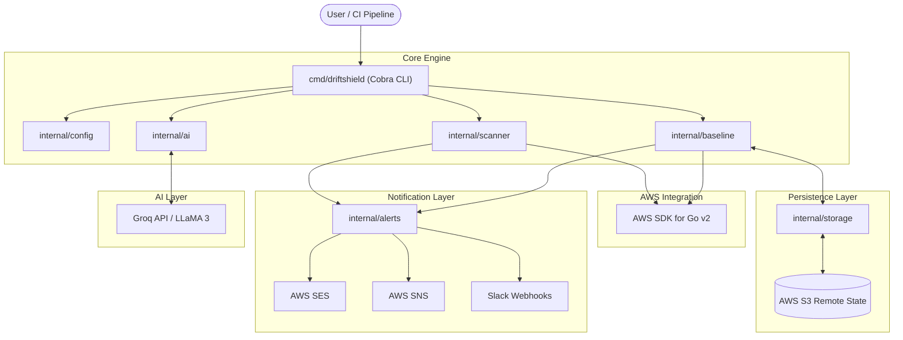

# DriftShield Architecture

DriftShield is a highly modular, enterprise-ready Cloud Security Posture Management (CSPM) and Drift Detection tool. It is written in **Go (Golang)** and designed to compile into a single, dependency-free binary for high-speed execution in CI/CD pipelines.

This document outlines the core architectural components, data flows, and design decisions of the project.

---

## 1. High-Level Architecture Diagram

---

## 2. Directory Structure & Separation of Concerns

DriftShield follows standard Go project layout principles, isolating logic into highly cohesive internal packages.

### `cmd/driftshield/`
* **Purpose:** The entry point of the application.
* **Component:** Implements the `spf13/cobra` CLI framework.
* **Responsibilities:** Defines flags (e.g., `--region`, `--dry-run`), parses arguments, initializes context, handles early exits (`os.Exit(1)`), and routes commands to the appropriate internal packages.

### `internal/scanner/`
* **Purpose:** The AWS ingestion layer.
* **Responsibilities:** Uses `aws-sdk-go-v2` to query the live state of AWS services (EC2, S3, IAM, CloudTrail, RDS, VPC). It is purely a read-only data extraction layer.

### `internal/baseline/`
* **Purpose:** The core business logic and diff engine.
* **Responsibilities:** 
  1. **Creation:** Takes output from `scanner` and formats it into a strict schema.
  2. **Diffing:** Compares the live `scanner` state against the stored baseline state to identify configuration drifts.
  3. **Remediation:** Executes AWS API calls (e.g., `RevokeSecurityGroupIngress`) to restore drifted infrastructure, intercepting these calls if `--dry-run` is active.

### `internal/storage/`
* **Purpose:** The persistence abstraction layer.
* **Responsibilities:** Implements a `StateBackend` interface. Currently powered by `S3Backend`, it handles saving and retrieving serialized JSON baseline files securely from a centralized S3 bucket.

### `internal/alerts/`
* **Purpose:** The outbound notification router.
* **Responsibilities:** Formats and routes vulnerability findings and drift reports to configured sinks (Slack, AWS SES, AWS SNS).

### `internal/ai/`
* **Purpose:** Interactive configuration generation.
* **Responsibilities:** Connects to the Groq API (LLaMA 3) to ask users contextual questions about their infrastructure and automatically synthesize secure JSON baselines.

### `tests/`
* **Purpose:** Centralized unit testing suite.
* **Responsibilities:** Contains isolated unit tests for `ai`, `alerts`, `baseline`, `config`, `display`, `scanner`, and `storage` packages without external network dependencies.

---

## 3. Core Execution Flows

### The `drift` Flow
1. **Initialize:** `cmd` invokes `runS3Drift()`.
2. **Fetch Live State:** `scanner.ScanS3()` fetches current AWS configurations.
3. **Fetch Baseline:** `storage.Load()` pulls the `s3_baseline.json` from the S3 Remote State Bucket.
4. **Compare:** `baseline.CompareS3WithBaseline()` performs a deep diff between the live state and the remote state.
5. **Alert:** If drifts are found, `alerts.SendS3DriftAlerts()` fires notifications to Slack/SES.
6. **Fail-Fast:** The CLI global `exitWithFailure` is set to `true`, eventually causing `os.Exit(1)`.

### The `fix --dry-run` Flow
1. **Identify Drifts:** Identical to the `drift` flow.
2. **Pre-Flight Check:** `Remediate*Drift()` receives the `dryRun: true` parameter.
3. **Simulate:** Instead of invoking destructive AWS SDK methods (like `PutPublicAccessBlock`), the function skips the API call, formats a `[DRY-RUN]` message, and appends the simulated action to the `Fixed` array.
4. **Report:** Outputs the simulated changes to the terminal.

---

## 4. Design Decisions

### S3 Remote State vs. Local Files
DriftShield initially used local `.json` files for baselines. This was upgraded to an **S3 Remote State Backend** to support GitOps and CI/CD. By storing state centrally in S3 (secured via strict Bucket Policies), multiple CI/CD runners and engineers can query the exact same source of truth simultaneously.

### Global Error Propagation
Rather than having deep nested functions call `os.Exit(1)` (which disrupts unit testing and cross-service aggregation), DriftShield uses a global `exitWithFailure` flag inside `main.go`. This ensures all scheduled tasks (e.g., `driftshield all drift`) complete fully, firing all relevant alerts, before terminating the pipeline with a non-zero exit code.

### AWS Authentication Delegation
DriftShield relies completely on the `awsconfig.LoadDefaultConfig()` standard credential chain. It does not handle static keys directly. This allows it to inherit robust, temporary authentication via OIDC in GitHub Actions, ECS Task Roles, or EC2 Instance Profiles securely.
